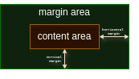
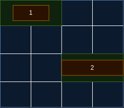

# Documentation to GUI layout format

## General structure

  
*Fig.1 - Block Structure of the layout*

  
*Fig.2 - Page Layout example*

### Layout code example for [Fig.2]
```yaml
defaults: &defaults
  type: "container" # also supported: button|text|input
  parent: null
  inner-grid: [1, 1] # [rows, cols]
  grid-size: [1, 1] # [rows cols]
  grid-position: [0, 0] # [rows cols]
  content-area:
    type: relative # also can be "absolute"
    size: [1, 1] # here it's a size relative to the grid cells this block occupies
  
# Special name for the root block
root:
  <<: *defaults
  rows: 4
  cols: 4
  
block-1:
  <<: *defaults
  type: button
  parent: root
  grid-size: [1, 2]
  grid-position: [0, 0]
  content-area: 
    type: absolute
    size: [100, 50] # [width height]

block-2:
  <<: *defaults
  type: text
  parent: root
  grid-size: [1, 2]
  grid-position: [2, 2]
  content-area:
    type: relative
    size: [1, 0.6] # [width height]

```
